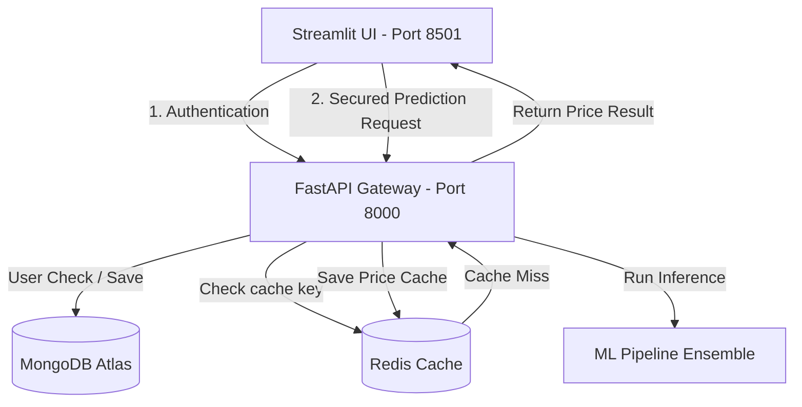

# 💻 Laptop Price Predictor Pro

**Live Link**: [https://laptop-price-predictor-oi00.onrender.com/](https://laptop-price-predictor-oi00.onrender.com/)

**Project Aim**: This project aims to predict laptop prices based on various specifications such as brand, processor, RAM, storage capacity, screen size, and screen resolution.


[](https://fastapi.tiangolo.com/)
[](https://streamlit.io/)
[](https://xgboost.readthedocs.io/)
[](https://lightgbm.readthedocs.io/)
[](https://www.mongodb.com/)
[](https://redis.io/)

A production-grade machine learning application designed to predict laptop prices based on comprehensive hardware specifications. The architecture leverages a **FastAPI backend** (with secure JWT authentication, request validation, Redis caching, and Prometheus monitoring) and a sleek, responsive **Streamlit frontend**. The prediction engine is powered by an optimized ensemble combining **XGBoost, LightGBM, Random Forest, Extra Trees, and HistGradientBoosting** regressors.

---

## 📐 Architecture Overview

The system is designed with a clear separation of concerns, optimized for low latency and security:



- **Frontend (Streamlit)**: Collects features through a segmented user interface (Brand, Memory/Storage, CPU/Display) and handles JWT authentication sessions.
- **Backend API (FastAPI)**: Serves REST endpoints, validates inputs via Pydantic, checks route permissions via JWT tokens, logs requests, and exposes Prometheus metrics.
- **Caching Layer (Redis)**: Uses MD5 hashing on input parameters to cache price predictions for 24 hours, dropping latency to sub-millisecond on cache hits. Falls back gracefully to an in-memory dictionary if Redis is offline.
- **Persistent Database (MongoDB)**: Stores user credentials securely. Works with MongoDB Atlas or local database instances.

---

## 🛠️ Project Directory Structure

```directory
.
├── app.py                  # Streamlit Frontend application
├── app/                    # FastAPI Backend package
│   ├── __init__.py
│   ├── main.py             # FastAPI App definition & Middleware registration
│   ├── api/                # API router components
│   │   ├── __init__.py
│   │   ├── routes_auth.py  # User Registration & JWT Authentication endpoints
│   │   └── routes_predict.py # Secured inference endpoints
│   ├── cache/
│   │   └── redis_cache.py  # Redis Client wrapper with in-memory fallback
│   ├── core/
│   │   ├── config.py       # Configuration settings / Pydantic environment loaders
│   │   ├── database.py     # MongoDB client setup & user CRUD operations
│   │   ├── dependencies.py # API validation and current user parsing
│   │   ├── exceptions.py   # Global custom validation & model exceptions
│   │   └── security.py     # JWT token signing & verification utilities
│   ├── middleware/
│   │   └── logging_middleware.py # Request logs (incoming/outgoing & elapsed execution time)
│   ├── models/             # Exported artifacts directory
│   │   ├── df.pkl          # Reference DataFrame structure
│   │   └── pipe.pkl        # Serialized Voting Ensemble pipeline
│   ├── services/
│   │   └── model_service.py # Preprocessing, feature calculations, and cached inference
│   └── utils/
│       └── logger.py       # Standard application logger setup
├── data/
│   └── laptop_data.csv     # Raw dataset used for model training
├── training/               # Model creation and experimentation package
│   ├── __init__.py
│   ├── train_model.py      # Automated preprocessing, feature engineering & training script
│   └── train_utils.py      # Custom Parsers for RAM, CPU speeds, HDD, SSD, and screen size
├── Dockerfile              # Containerization recipe for unified deployment
├── docker-compose.yml      # Docker Compose configuration for multi-service environments
├── render.yaml             # Infrastructure as Code (IaC) deployment descriptor for Render
├── start.sh                # Shell script to sequence Redis, FastAPI, and Streamlit execution
├── requirements.txt        # Full Python dependencies manifest
└── README.md               # Project documentation
```

---

## 🧠 Machine Learning Engine & Pipeline

The pipeline is trained on **laptop_data.csv** and uses custom transformations before feeding the engineered features into a **Voting Regressor** ensemble.

### 1. Preprocessing & Feature Engineering
- **RAM**: Stripped of "GB" suffix and converted to standard integer format.
- **Weight**: Stripped of "kg" suffix and converted to float representation.
- **Touchscreen & IPS**: Extracted using regular expressions from the `ScreenResolution` field.
- **Pixels Per Inch (PPI)**: Dynamically calculated using resolution dimensions and diagonal screen size:
  $$\text{PPI} = \frac{\sqrt{X_{\text{res}}^2 + Y_{\text{res}}^2}}{\text{Screen Size (Inches)}}$$
- **CPU Brand & Speed**: Segmented into 5 distinct categories (`Intel Core i7`, `Intel Core i5`, `Intel Core i3`, `Other Intel Processor`, `AMD Processor`) with speeds parsed from GHz values.
- **Storage Configuration**: Advanced parsing separating `HDD`, `SSD`, `Hybrid`, and `Flash` capacities (handles dual drives e.g., `128GB SSD + 1TB HDD`).
- **GPU Brand**: Cleansed and reduced to primary manufacturer (Intel, AMD, Nvidia). ARM GPUs are filtered out due to sparsity.
- **OS Categorization**: Standardized into `Windows`, `Mac`, and `Others/No OS/Linux`.

### 2. Model Ensemble
The target variable `Price` is log-transformed (`np.log(df['Price'])`) during training to stabilize variance and minimize proportional errors. The final prediction uses exponentiation (`np.exp`) to revert to the price scale.

The ensemble combines five estimators:
| Estimator | Implementation | Hyperparameters / Details | Weight |
| :--- | :--- | :--- | :--- |
| **RF** | `RandomForestRegressor` | 100 estimators, max features 0.45, max depth 26 | `1.0` |
| **ET** | `ExtraTreesRegressor` | 100 estimators, max features 0.45, max depth 26, bootstrapped | `0.5` |
| **HGB** | `HistGradientBoostingRegressor`| 150 iterations, learning rate 0.08, max depth 8 | `3.0` |
| **XGB** | `XGBRegressor` | 120 estimators, learning rate 0.08, subsample 0.8 | `1.0` |
| **LGB** | `LGBMRegressor` | 120 estimators, learning rate 0.08, max depth 6, subsample 0.8 | `1.0` |

### 3. Pipeline Performance
- **R2 Score (Log space)**: `~0.9168`
- **Mean Absolute Error (MAE)**: Calculated in the original price space.

---

## ⚡ Setup & Installation

### 1. Prerequisites
- Python 3.10 or 3.11
- MongoDB (Local server or MongoDB Atlas Cluster URI)
- Redis server (Optional - fallback in-memory cache is used if not running)

### 2. Local Virtual Environment Setup
1. Clone the repository and navigate to the project directory:
   ```bash
   git clone <repository_url>
   cd Laptop_Price_Prediction
   ```
2. Create and activate a virtual environment:
   ```bash
   python3 -m venv myenv
   source myenv/bin/activate  # On Windows, use: myenv\Scripts\activate
   ```
3. Install required packages:
   ```bash
   pip install --upgrade pip
   pip install -r requirements.txt
   ```

### 3. Environment Variables Config (`.env`)
Create a `.env` file in the root directory and configure the variables. Example configuration:
```env
# Security Configuration
SECRET_KEY=supersecretjwtkeyforlaptoppricepredictionapi123!
API_KEY=lappredict_secure_api_key_2026
ACCESS_TOKEN_EXPIRE_MINUTES=60

# Redis Cache Config
REDIS_HOST=localhost
REDIS_PORT=6379
REDIS_DB=0

# MongoDB Configuration
MONGO_URI=mongodb+srv://<username>:<password>@cluster0.mongodb.net/laptop_price_db
MONGO_DB=laptop_price_db

# Model Paths
MODEL_PATH=app/models/pipe.pkl
DF_PATH=app/models/df.pkl
```

### 4. Train and Export Model Assets
Run the model training pipeline to generate the models (`df.pkl` and `pipe.pkl`):
```bash
python -m training.train_model
```
Once run, the artifacts will be exported to `app/models/`.

### 5. Running the Application Locally
You can run the components individually:
- **FastAPI Backend**:
  ```bash
  uvicorn app.main:app --host 127.0.0.1 --port 8000 --reload
  ```
- **Streamlit Frontend**:
  ```bash
  streamlit run app.py --server.port 8501
  ```
Alternatively, run the unified script to start Redis, FastAPI, and Streamlit together:
```bash
./start.sh
```

---

## 🐳 Containerization & Deployment

### Docker Compose
Run the entire application bundle locally inside a containerized workspace:
```bash
docker-compose up --build
```
This mounts the application services and starts them securely. The Streamlit frontend is exposed publicly at `http://localhost:8501`.

### Render Deployment (`render.yaml`)
To deploy as a single service on Render:
1. Ensure your MongoDB Atlas connection whitelist includes `0.0.0.0/0` to allow access from Render instances.
2. Render uses `render.yaml` to spin up a unified container running `start.sh`, exposing Streamlit on port `8501` and connecting internal components via local network configurations automatically.

---

## 🔌 API Endpoints Documentation

FastAPI provides an interactive OpenAPI interface available at `http://localhost:8000/docs` or `http://localhost:8000/redoc`.

### Authentication Endpoints

#### 1. Sign Up (`POST /api/v1/auth/signup`)
Creates a new user profile inside MongoDB.
* **Payload**:
  ```json
  {
    "username": "developer",
    "password": "secure_password"
  }
  ```
* **Success Response (201 Created)**:
  ```json
  {
    "success": true,
    "message": "User registered successfully! You can now log in."
  }
  ```

#### 2. Log In (`POST /api/v1/auth/login`)
Validates user credentials and returns a bearer JWT access token.
* **Payload**:
  ```json
  {
    "username": "developer",
    "password": "secure_password"
  }
  ```
* **Success Response (200 OK)**:
  ```json
  {
    "access_token": "eyJhbGciOiJIUzI1NiIsInR5cCI6IkpXVCJ9...",
    "token_type": "bearer"
  }
  ```

### Prediction Endpoint

#### Predict Price (`POST /api/v1/predict`)
Performs price prediction calculations.
* **Headers**: `Authorization: Bearer <access_token>`
* **Payload**:
  ```json
  {
    "Company": "HP",
    "TypeName": "Notebook",
    "Ram": 8,
    "Weight": 2.0,
    "Touchscreen": "No",
    "Ips": "No",
    "Screen_size": 15.6,
    "Resolution": "1920x1080",
    "Cpu_brand": "Intel Core i5",
    "Cpu_Speed": 2.5,
    "HDD": 0,
    "SSD": 256,
    "Gpu_brand": "Intel",
    "OS": "Windows"
  }
  ```
* **Success Response (200 OK)**:
  ```json
  {
    "success": true,
    "predicted_price": 54620,
    "currency": "INR"
  }
  ```

---

## 📈 Monitoring & Logging
- **Monitoring**: Prometheus instrumentation automatically tracks application requests, latency percentiles, and errors. The `/metrics` endpoint is exposed and ready to be scraped by Prometheus servers.
- **Logging**: Detailed logger config (`app/utils/logger.py`) and custom `RequestLoggingMiddleware` output execution time and status details for every routing request. Example console output:
  ```text
  ---> POST /api/v1/predict
  Cache hit for key pred_9f688bb6b3d4f40f09800e12e2f3d9d3!
  <--- POST /api/v1/predict Completed with Status 200 in 2.15ms
  ```
